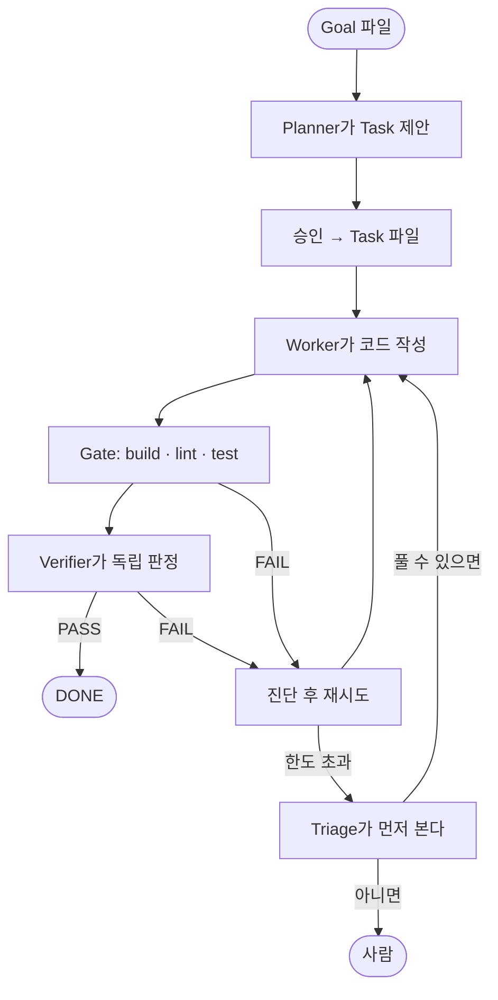
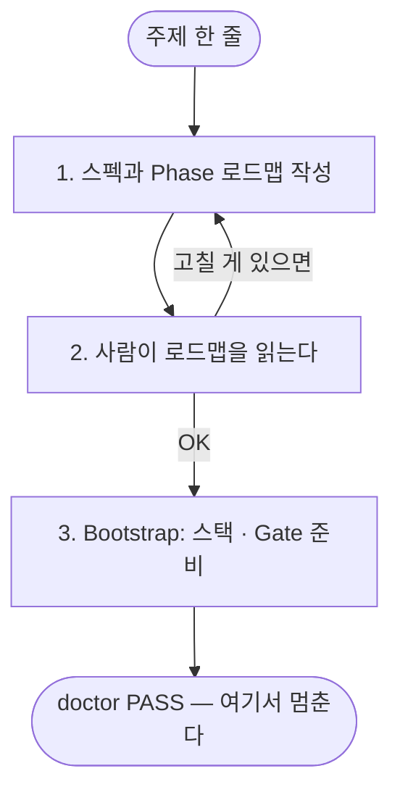
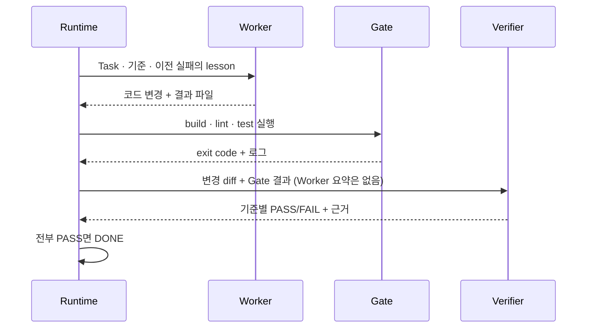
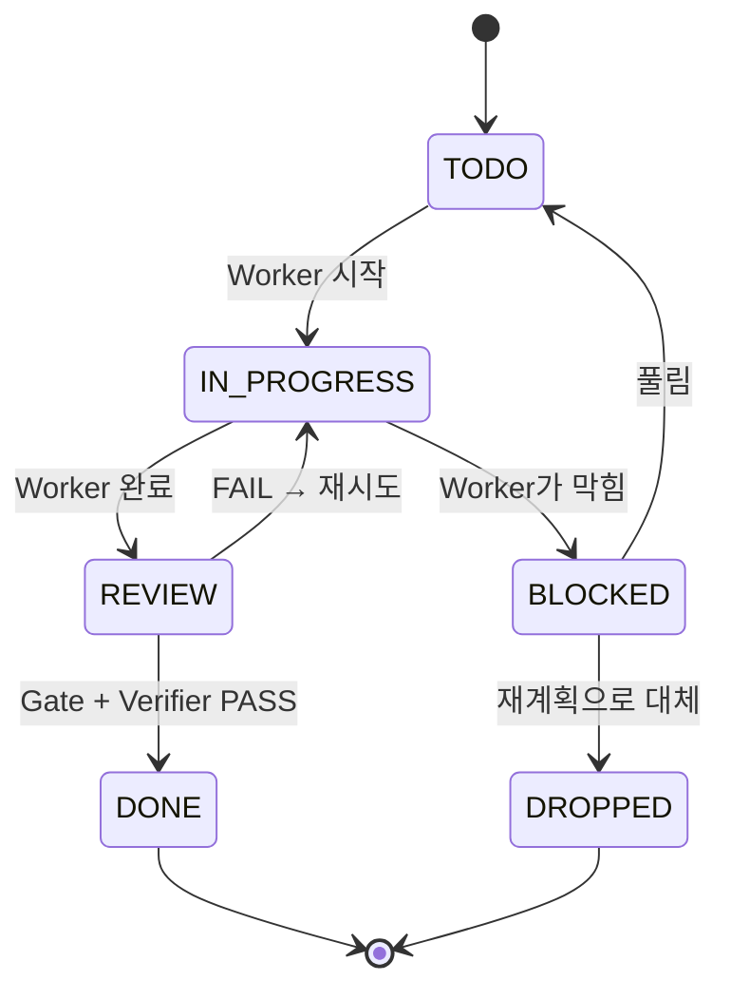
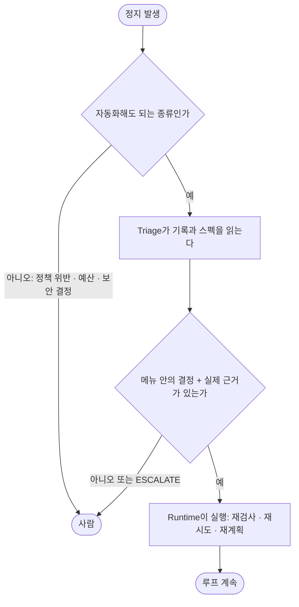

# molt-loop — Loop Runtime Starter Pack

AI Worker에게 프로젝트를 맡기되, **완료 판정은 AI에게 맡기지 않는** 실행 런타임.

목표 하나를 주면 Task로 쪼개고, Worker를 돌리고, 결정론적 Gate와 독립 Verifier로 검증하고,
실패하면 진단해서 재시도하고, 그래도 안 되면 읽기 전용 Triage가 먼저 보고, 정말 사람이 필요한
지점에서만 멈춘다. 그 전 과정이 파일로 남는다.

이 저장소는 **새 프로젝트에 복사해서 쓰는 Starter Pack**이다. 제품 코드는 들어 있지 않다.



역할은 넷이다. **Planner**(계획) · **Worker**(구현) · **Verifier**(판정) · **Triage**(정지 처리).
전부 서로 다른 AI 호출이고 대화를 공유하지 않는다. 완료를 결정하는 것은 이 중 누구도 아닌 **Runtime**이다.

---

## 30초 요약

```bash
./loopctl doctor                                      # 준비됐는지 (AI 호출 없음)
./loopctl start --file phase-prompt/01-foundation.md  # 계획 → 승인 → 실행, 끝까지
./loopctl status                                      # 어디까지 됐고, 다음에 뭘 칠지 (NEXT)
```

빠르게 가야 하면 `./loopctl quick "README에 설치 절차를 추가한다"`.
멈추면 같은 명령을 다시 치면 이어서 간다. 그게 전부다.

---

## 목차

- [무엇이 다른가](#무엇이-다른가)
- [설치](#설치)
- [처음 쓰는 법 — 새 프로젝트 시작](#처음-쓰는-법--새-프로젝트-시작)
- [일상적인 사용 — Phase 하나 돌리기](#일상적인-사용--phase-하나-돌리기)
- [Task 하나가 지나가는 길](#task-하나가-지나가는-길)
- [멈췄을 때 무슨 일이 일어나는가 — Triage](#멈췄을-때-무슨-일이-일어나는가--triage)
- [무엇이 산출되는가](#무엇이-산출되는가)
- [명령 레퍼런스](#명령-레퍼런스)
- [비용과 시간](#비용과-시간)
- [막혔을 때](#막혔을-때)
- [설정](#설정)
- [설계 원칙](#설계-원칙)
- [저장소 구조](#저장소-구조)
- [아직 없는 것 · 한계](#아직-없는-것--한계)
- [더 읽기](#더-읽기)

---

## 무엇이 다른가

AI에게 "이거 만들어 줘"라고 시키는 것과의 차이는 **누가 완료를 선언하는가**다.

| | 보통의 AI 코딩 | Loop Runtime |
| --- | --- | --- |
| 완료 판정 | AI가 "다 했습니다"라고 말함 | Runtime이 Gate 실행 결과 + 독립 Verifier 판정으로 결정 |
| 상태 변경 | AI가 파일을 직접 고침 | Runtime만 씀 (Single Writer). Worker는 요청만 가능 |
| 검증자 | 구현한 AI가 자기 결과를 확인 | 구현자를 모르는 별도 세션. Worker의 요약을 아예 받지 않음 |
| 근거 | "테스트 통과했습니다" | Runtime이 직접 실행한 명령의 exit code와 로그 파일 |
| 실패 | 같은 시도 반복 | 결정론적 진단 → lesson 1건 주입 → 한도 초과 시 Triage → 그래도 안 되면 사람 |
| 사람이 멈추는 곳 | 매번 | 정책 위반 · 예산 · 보안/비가역 결정 · 스펙에 답이 없는 질문 |

핵심 문장 세 개다.

> **Worker의 주장은 Evidence가 아니다.**
> **독립 검증은 Session 분리가 아니라 Input 분리다.**
> **설치된 의존성은 구현된 기능이 아니다.**

---

## 설치

필요한 것은 두 가지뿐이다.

| | 요구사항 | 확인 |
| --- | --- | --- |
| Node.js | 22 이상 (LTS). 개발·검증은 v24.19.0 | `node --version` |
| Provider CLI | [Claude Code](https://claude.com/claude-code) | `claude --version` |

Runtime 자체는 **의존성이 없다.** `npm install`이 필요 없고 `package.json`도 쓰지 않는다.

```bash
git clone https://github.com/JJleem/molt-loop.git my-project
cd my-project
rm -rf .git && git init          # 새 프로젝트의 역사를 새로 시작한다

./loopctl doctor                 # 구조 점검
./loopctl adapters               # provider CLI가 잡히는지
```

`doctor`가 exit 0이면 준비된 것이다. 이 시점에 Gate 3개가 전부 `disabled`인 것은 **정상이다.**
아직 프로젝트 스택이 없기 때문이며, Bootstrap이 채운다.

```
$ ./loopctl gates
build   timeout= 300s  disabled (package.json 없음 - build script 미정의)
lint    timeout= 300s  disabled (package.json 없음 - lint script 미정의)
test    timeout= 300s  disabled (package.json 없음 - test script 미정의)
```

Windows는 `.\loopctl`을 쓴다. 진입점은 인자를 그대로 넘기고 exit code를 그대로 돌려주는
얇은 wrapper이며 Runtime 로직이 들어 있지 않다.

---

## 처음 쓰는 법 — 새 프로젝트 시작

복사한 직후 **대화형 Claude 세션을 열고 `START-HERE.md`를 첫 프롬프트로 준 뒤, 만들고 싶은 것을 한 줄로 말한다.**
예를 들면 이렇게.

```text
내가 만들고 싶은 건
"CSV 가계부 파일을 올리면 월별 지출 리포트를 보여주는 웹 앱"이야.
처음부터 시작해줘.
```

또는:

```text
프로젝트 주제:
"회사 위키 문서를 로컬에서 검색하고 요약하는 CLI 도구"

시작해줘.
```

여기까지는 Runtime이 아니라 대화형 세션의 일이다. 그 세션이 세 단계를 진행하고 Phase 1 직전에 멈춘다.



| 단계 | 쓰는 프롬프트 | 만들어지는 것 |
| --- | --- | --- |
| 1 | `prompts/PROJECT-PHASE-PLANNER.md` | `docs/PRODUCT-SPEC.md`, `phase-prompt/01-*.md … Goal.md` |
| 2 | (사람) | 로드맵 검토 |
| 3 | `prompts/PROJECT-BOOTSTRAP.md` | 스택 scaffold, build/lint/test, `.loop/project.yaml` Gate, `docs/SYSTEM-MAP.md` |

**Step 1 — 무엇을 만들 것인가.** 주제를 말하면 `PROJECT-PHASE-PLANNER.md`가
`docs/PRODUCT-SPEC.md`(이후 모든 것의 source of truth)와 `phase-prompt/01-*.md … Goal.md`를 만든다.
**계획만 한다.** Task도 코드도 만들지 않는다. 위 가계부 예시라면 Phase는 대략
"CSV 파싱과 월별 집계 → 리포트 화면 → 파일 업로드와 저장 → 마무리" 정도로 나뉜다.

**Step 2 — 사람이 읽는다.** Phase 분할이 말이 되는지 본다. 여기서 잘못되면 뒤가 전부 잘못된다.
이 문서들은 나중에 Triage가 질문에 답할 때 보는 근거이기도 하다. 스펙이 애매하면 Runtime도 애매하게 간다.

**Step 3 — Bootstrap.** `PROJECT-BOOTSTRAP.md`가 **최소한의 실제 개발 환경**을 만든다.
Phase 1 기능은 구현하지 않는다. 명령을 실제로 실행해서 exit 0을 확인한 뒤에만 `.loop/project.yaml`의
Gate를 켠다. 존재하지 않는 명령을 Gate에 적지 않고, 없는 architecture를 SYSTEM-MAP에 적지 않는다.

여기까지 끝나면 Phase 1을 돌릴 수 있다.

---

## 일상적인 사용 — Phase 하나 돌리기

### 한 줄

```bash
./loopctl start --file phase-prompt/01-foundation.md
```

이 한 줄이 계획 → 승인 → 실행을 끝까지 잇는다. **명령 자체가 그 파일에 대한 승인이다.**
다른 파일로 범위를 넓히지 않는다. 사람이 필요한 지점에서 멈추고, 같은 명령을 다시 치면 남은 곳부터 이어간다.
Phase 여러 개를 미리 승인하려면 `--file`을 순서대로 여러 번 준다.

```bash
./loopctl status
```

`status`는 상태를 나열하고 맨 아래 `NEXT`에 **다음에 칠 명령 하나**를 보여준다.
파일 상태에서만 결정론적으로 고르고 AI를 부르지 않는다.

```
NEXT
  loopctl execute-plan PLAN-20260915T031200Z
      2 of 5 task(s) remaining; re-running resumes from them
```

### 빠르게 가야 할 때

```bash
./loopctl quick "README에 설치 절차를 추가한다"
./loopctl quick --file phase-prompt/03-small-fix.md
```

`quick`은 `start`와 같은 흐름에 `.loop/project.yaml`의 `quick` 프로필을 적용한다.
Starter 기본값은 Worker·Verifier effort `low`, Planner `medium`, Plan당 최대 4 Task, Phase 끝 Goal 검증 생략이다.

**바뀌지 않는 것:** Gate는 그대로 돈다. Verifier가 필요한 Task는 그대로 검증한다. Runtime이 판정하고
Worker는 완료를 선언할 수 없다. **빨라지는 것은 AI 호출의 크기이지 검증의 깊이가 아니다.**

### 단계별로 보고 싶을 때

```bash
./loopctl plan --file phase-prompt/01-foundation.md   # AI 호출 1회. Task는 아직 없다
./loopctl plan-show latest                            # 사람이 읽는다
./loopctl plan-approve latest                         # 여기서 처음 Task 파일이 생긴다
./loopctl execute-plan latest                         # Task를 하나씩 끝까지
```

`latest`는 가장 최근 Plan이다. ID를 복사할 필요가 없다.

**`plan`** — 읽기 전용 Planner 세션이 저장소를 조사하고 Task 제안을 낸다. `Read`·`Grep`·`Glob`만 주고,
실행 전후 저장소 지문을 대조해서 아무것도 바꾸지 않았음을 Runtime이 직접 확인한다.

```
Plan: PLAN-20260827T035251Z
Planner Result:  PROPOSED
Tasks proposed:  4

P1  공통 변환 인터페이스 추가
P2  OBJ 변환            depends on: P1
P3  STL 변환            depends on: P1
P4  브라우저 뷰어        depends on: P2, P3

Validation: PASS
No tasks have been created.
```

Runtime이 결정론적으로 검증한다. Role이 설치되어 있는지, Gate 이름이 설정에 있고 활성인지,
Acceptance Criteria가 판정 가능한지, 의존 그래프에 순환이 없는지. 검증 실패면 승인 자체가 불가능하다.

**`plan-approve`** — 사람의 승인 경계. AI를 호출하지 않는다. canonical Task ID(`TASK-001`…)를 발급하고
파일을 쓴다. 계획 시점 이후 저장소가 바뀌었으면 거부한다. `--force`는 없다.

**`execute-plan`** — 의존 순서대로 실행한다. Task 하나마다 아래 루프가 돈다.

### Phase가 끝나면

`docs/SYSTEM-MAP.md`를 갱신한다. 단, **Phase 최종 DONE 또는 architecture 경계가 바뀌었을 때만.**
Task마다 갱신하지 않는다. 규칙은 `CLAUDE.local.md`에 있다.

---

## Task 하나가 지나가는 길

`execute-plan`이 Task 하나에 대해 하는 일이다. 오케스트레이션 판단은 전부 결정론적이며 AI를 부르지 않는다.

성공하는 경우의 순서다.



실패하면 Runtime이 실패를 분류하고(AI 없음) lesson 한 줄을 만들어 Worker를 다시 부른다.
한도를 넘기거나 애매한 정지가 나면 Triage가 본다. 그 부분은 [다음 절](#멈췄을-때-무슨-일이-일어나는가--triage)에 있다.

Task 상태는 여섯 개뿐이고 전이는 표에 있는 것만 존재한다. Runtime만 쓴다.



`DONE`으로 가는 전이는 하나뿐이다. Worker도 Verifier도 Triage도 그 전이를 요청조차 할 수 없다.

---

## 멈췄을 때 무슨 일이 일어나는가 — Triage

실제로 써 보면 "이건 내가 아니라 다른 agent가 봐도 됐을 텐데" 싶은 정지가 많다.
Gate 도는 동안 사람이 메모 파일 하나 만들었다고 $2.75짜리 Run이 사람을 기다린 실측이 있다(OBS-003).
그래서 Runtime과 사람 사이에 **Triage**라는 층이 있다. 기본으로 켜져 있다.



어떤 정지에 어떤 메뉴가 나오는지는 아래 표에 있다.

**Triage가 할 수 있는 것.** Runtime이 정지 사유별로 만든 메뉴에서 하나를 고른다. 메뉴는 사람이
`resume` · `retry` · `gate --rerun` · `verify --rerun`으로 할 수 있는 복구 행동과 같다.

| 결정 | 하는 일 | 언제 |
| --- | --- | --- |
| `RERUN_GATES` | 현재 저장소로 Gate 재실행 → Verifier | 바뀐 파일이 제품과 무관하거나 Gate가 환경 탓에 timeout |
| `RERUN_VERIFIER` | 같은 구현에 Verifier 한 번 더 | Verifier가 timeout · crash · 형식 오류로 판정을 못 냄 |
| `RETRY_WITH_LESSON` | lesson 한 줄을 넣고 Worker 1회 더 | 실패 기록이 구체적 원인 하나를 가리킴 |
| `UNBLOCK` | 설명을 붙여 BLOCKED → TODO | Worker의 질문에 스펙·저장소에 답이 있음 |
| `REPLAN` | 남은 Task를 DROPPED로 내리고 재계획 | Task 분해 자체가 틀림. Phase당 1회 |
| `ANSWER` | 스펙에 적힌 답을 Goal에 붙여 재계획 | Planner 질문이 `spec` · `implementation` 분류뿐일 때 |
| `ESCALATE` | 사람에게 | 언제나. 근거가 없으면 이것이 정답이다 |

**Triage가 절대 할 수 없는 것.** DONE 전이는 메뉴에 없다. 결정마다 Verifier와 같은 `evidence_basis` ·
`evidence_refs`가 필수이고 Runtime이 경로의 존재를 확인한다. 메뉴 밖 결정 · 없는 경로 · 결과 없음은 전부
ESCALATE로 처리된다. REPLAN과 ANSWER는 `start`/`quick` 아래에서만 실행된다. 그 명령이 Goal에 대한
계획 권한이기 때문이다.

**틀리면 어떻게 되는가.** 결과는 잘못된 DONE이 아니라 **돈**이다. Triage는 완료를 선언할 수 없고,
Worker는 push·배포를 할 수 없고, 같은 실패의 반복은 `STALLED`가 잡고, `limits.yaml`의 판단 예산과
`budget.plan_usd`가 상한이다. 그래서 Triage를 켜고 쓸 때는 Plan 예산을 같이 켜는 것을 권한다.

**그래서 사람은 어디에 남는가.** 두 끝이다. 앞에는 스펙과 Goal 파일(Triage가 답하는 근거), 뒤에는 최종 인수.
DONE은 "Goal과 일치한다"이지 "내가 원한 것"이 아니다. 그리고 브라우저 · 수동 조작 같은 **관찰되지 않은 실행이
필요한 AC는 Triage가 있어도 PASS할 수 없다.** 그런 Task는 e2e 같은 자동 Gate가 있어야 사람 없이 끝난다.

끄고 싶으면 `limits.yaml`의 `triage` 절을 지우거나 `--profile manual`을 쓴다.

---

## 무엇이 산출되는가

크게 셋이다. **하나는 저장소에 남는 상태, 둘은 로컬 기록.**

```
.loop/tasks/*.yaml     Task — 추적되는 프로젝트 상태 (git에 커밋된다)
.loop-local/plans/     Plan 산출물 — 로컬 기록 (gitignore)
.loop-local/runs/      Run 산출물 — 로컬 기록 (gitignore)
```

### 1. Task 파일 — 유일하게 커밋되는 산출물

`plan-approve`가 만든다. 사람이 읽고 고칠 수 있는 YAML이다.

```yaml
# 공통 변환 인터페이스 추가
# Runtime이 PLAN-20260827T035251Z 승인 시점에 생성했다 (proposal P1).

id: TASK-001
status: TODO

request: |-
  기존 변환 아키텍처를 이용해 공통 인터페이스를 정의한다.

execution:
  role: impl

stop_condition:
  gates: [build, test]
  requires_verifier: true
  max_consecutive_failures: 2

acceptance_criteria:
  - id: AC1
    description: |-
      인터페이스가 정의되고 export 된다.
    verification:
      type: verifier          # 판단이 필요한 기준
  - id: AC2
    description: |-
      build gate가 통과한다.
    verification:
      type: gate              # 결정론적으로 판정된다
      ref: build

evidence: []
failure_memo: []
```

선행 Task가 있으면 `depends_on: [TASK-001]`이 붙는다. 선행이 DONE이 아니면 READY가 아니다.

### 2. Plan 산출물

```
.loop-local/plans/PLAN-20260827T035251Z/
├─ context.md              Planner가 받은 입력 전문
├─ manifest.json           입력 출처 · 제외 목록 · 저장소 지문
├─ planner-result.json     Planner가 낸 원본 + 검증 결과 + 정규화본
├─ planner-envelope.json   Runtime이 관찰한 사실 — 프로세스 · 지문 · 토큰 · 비용
├─ plan-report.json        Runtime이 쓰는 정본 (승인 가능 여부는 여기서 결정)
├─ approval.json           승인 후에만 생김. P1 → TASK-001 매핑
├─ executions/             execute-plan 실행 기록
├─ goal-checks/            Phase 끝 Goal 검증 기록
├─ triage/                 Plan 수준 Triage 결정 (질문 답변 · Goal 검증 실패 replan)
└─ stdout.log · stderr.log
```

`planner-result.json`(AI의 주장)과 `planner-envelope.json`(Runtime의 관찰)이 **끝까지 분리되어** 저장된다.

### 3. Run 산출물 — Task 하나의 시도 하나

```
.loop-local/runs/RUN-20260827T035251Z-TASK-001/
├─ context.md              Worker가 받은 입력 전문
├─ manifest.json           입력 해시 · attempt · lineage
├─ worker-result.json      Worker의 주장
├─ runtime-envelope.json   Runtime의 관찰 — 종료 코드 · 변경 파일 · 보호 파일 위반 · 토큰 · effort
├─ gate-report.json        Gate별 exit code · 로그 해시 · 종합 판정
├─ gates/<name>/           Gate별 stdout · stderr
├─ recovery/               diagnosis.json · failure-memo.json
├─ triage/<n>/             Triage 결정 — context.md · triage-result.json · triage-envelope.json
├─ stdout.log · stderr.log
└─ verification/
   ├─ context.md               Verifier가 받은 입력 (Worker 요약이 들어 있지 않다)
   ├─ canonical-diff.patch     Runtime이 만든 결정론적 변경 표현
   ├─ subject.json             검증 대상 저장소 지문
   ├─ verifier-result.json     Verifier의 판정 (AC별 evidence_basis 포함)
   ├─ verifier-envelope.json   Runtime의 관찰
   └─ verification-report.json 완료 판정의 정본 — 이게 PASS여야 DONE이 된다
```

`.loop-local/executions/EXEC-…/execution-report.json`에는 Task 하나의 전체 실행 요약
(시도 횟수 · 각 단계 결과 · Triage 결정 · 정지 사유 · 누적 사용량)이 남는다.

### 산출물을 읽는 명령

전부 **AI를 호출하지 않는다.** 기록된 파일을 읽기만 한다.

```bash
./loopctl status                 # 전체 현황 + NEXT
./loopctl show TASK-001          # Task 상세 + 왜 READY가 아닌지
./loopctl execution TASK-001     # 실행 보고서 (단계별 사건, Triage 결정 포함)
./loopctl verification TASK-001  # 검증 보고서 (AC별 판정과 근거)
./loopctl usage --all            # 토큰 · 비용 · Task별 추세 · 정지 사유별 횟수
./loopctl diagnose TASK-001      # 실패 진단
```

---

## 명령 레퍼런스

`./loopctl help`가 실제 구현된 전부를 보여준다. `<PLAN>` 자리에는 `latest`를 쓸 수 있다.

### 매일 쓰는 것

| 명령 | AI 호출 | 하는 일 |
| --- | :---: | --- |
| `start --file <goal.md> [--file …]` | 여러 번 | 지정한 목표에 대한 승인과 계획·실행 연결. 같은 명령으로 재개 |
| `quick "<GOAL>"` · `quick --file` | 여러 번 | `start`와 같은 흐름에 `quick` 프로필 적용 |
| `status` | 없음 | 전체 상태 + `NEXT` |
| `resume <RUN\|TASK\|PLAN>` | 필요시 | 중단 단계부터 재개. `--rerun-gates`로 현재 변경을 인정 |
| `usage --all \| <PLAN>` | 없음 | 단계별 시간 · 누적 비용 · Task별 추세 · 정지 사유 |
| `diagnose <RUN\|TASK>` | 없음 | 왜 멈췄는지 · Failure Memo |

### 단계별

| 명령 | AI 호출 | 하는 일 |
| --- | :---: | --- |
| `plan "<GOAL>"` · `plan --file` | 1회 | Goal → Task 제안. Task를 만들지 않는다 |
| `plan-show` · `plans` · `plan-approve` | 없음 | Plan 열람 · 승인 |
| `execute-plan <PLAN>` | 여러 번 | 승인한 Task 실행·재개 |

### Task 하나 · 디버깅

| 명령 | AI 호출 | 하는 일 |
| --- | :---: | --- |
| `run <TASK>` | 1회 | Worker 1회 |
| `gate <RUN\|TASK>` | 없음 | 설정된 Gate 실행 |
| `verify <RUN\|TASK>` | 1회 | 독립 Verifier 1회 |
| `retry <RUN\|TASK>` | 1회 | 진단 기반 재시도 1회 |
| `execute <TASK>` | 여러 번 | Task 하나를 정지 조건까지 |
| `self-check [<gate>]` | 없음 | Gate 명령 참고 실행 (판정 아님, Worker용) |

### 조회 · 저수준

`doctor` · `tasks` · `show` · `ready` · `verify-ready` · `gates` · `adapters` · `execution` · `verification` ·
`validate` · `transition` · `context` · `snapshot` · `help` · `version`. 전부 AI 호출 없음.

### 공통 플래그

`--profile <name>` 설정의 프로필 적용 · `--effort <low|medium|high|xhigh|max>` provider effort ·
`--model` · `--adapter` · `--timeout`. 명시적 플래그가 프로필보다 우선한다.

```
exit 0  성공 / 검사 통과
exit 1  명령은 돌았지만 요청한 작업이 실패하거나 거부됨
exit 2  잘못된 사용법
```

---

## 비용과 시간

토큰을 쓰는 지점은 다섯이고 전부 **1회 호출**이 단위다. 오케스트레이션 자체에는 AI를 쓰지 않는다.

```
plan     Planner  1회 / Phase
run      Worker   1회 / 시도            ← Phase 비용의 대부분 (실측 88%)
verify   Verifier 1회 / 시도
retry    Worker   1회
triage   Triage   0회 (성공 시) · 정지당 1회
```

승인 · 의존성 검증 · 순환 탐지 · Task ID 발급 · 진단 · 다음 행동 결정은 전부 0회다.

```bash
$ ./loopctl usage --all
  planner: 41.2s   worker: 1842.0s   gate: 60.3s   verifier: 310.5s   triage: 22.0s
Known cost: $16.7600; unknown cost: 0 invocation(s)
Human-required stops: 1; triage decisions: 1; retry worker cost (known): $0.0000
  stops by reason:
      1  RECOVERY_AMBIGUOUS

Per-task trend (worker cost is what grows; "?" = some calls reported no cost):
  task       worker$   vs prev  verifier$  calls  retries  worker out tok  worker cached in  time
  TASK-001   1.4938    -        0.5957     2      0        18,679          1,275,383         6.1m
  TASK-002   2.7520    +84%     0.4646     2      0        35,693          2,467,434         7.9m
  TASK-003   3.9183    +42%     0.7082     2      0        58,488          2,939,290         14.0m
```

### 손잡이

| 설정 | 하는 일 | 근거 |
| --- | --- | --- |
| `self-check` (자동) | Worker가 Gate를 미리 돌려본다 | 타입 오류 한 줄로 $4.04·9분 폐기 (OBS-007) |
| `worker_effort` 등 | provider `--effort` | Claude Code 2.1.272에서 확인 |
| `max_call_budget_usd` | 호출 1회 상한 | 호출 **뒤에** 검사됨. 첫 응답이 넘길 수 있다 (실측 0.05 상한에 $0.0899) |
| `runtime.profiles` | 위 값을 묶은 것 (`quick` · `manual`) | |
| `budget.plan_usd` | 누적 예산. 다음 유료 호출 전 검사 | |
| `isolate_workers` + `max_parallel_workers` | 독립 Worker 병렬 (Starter 기본 2) | |

**시간에 대해 솔직하게.** Task 하나는 6~15분이고 Worker가 대부분이다. Task는 순차로 검증되므로 8 Task Phase는
1.5~2시간이다. 이 Runtime이 줄이는 시간은 **사람이 기다리는 시간**(정지 → 확인 → 재개)과 낮은 effort뿐이다.
Task 자체의 벽시계 시간은 아직 안 줄였다. 실측 없이 최적화하지 않는다.

---

## 막혔을 때

| 증상 | 원인 | 할 일 |
| --- | --- | --- |
| 다음에 뭘 쳐야 할지 모르겠다 | | `./loopctl status` 맨 아래 `NEXT` |
| `No ready tasks` | 선행 Task가 DONE이 아니거나 PAUSE | `./loopctl ready`가 무엇을 기다리는지 보여준다 |
| Gate가 `ERROR` | 명령이 없거나 Gate가 disabled | `./loopctl gates`로 설정 확인 |
| `Plan approval refused: repository state changed` | 계획 이후 저장소가 바뀜 | 새로 `plan`한다. 우회 수단은 없다 |
| Verifier가 FAIL인데 이유가 모호 | | `./loopctl verification <TASK>`에 AC별 근거가 있다 |
| `NEEDS_HUMAN`으로 멈춤 | Triage도 ESCALATE했다 | `./loopctl diagnose <TASK>`, 근거는 `.loop-local/runs/<RUN>/triage/` |
| `GOAL_CHECK_FAILED` | Task는 다 DONE인데 Goal이 안 맞음 | Triage가 replan을 시도했거나 예산이 끝났다. Goal 파일을 본다 |
| 사람이 손으로 복구해서 DONE으로 만듦 | | `execution`이 `origin: manual`로 새 기록을 남긴다 |
| 전부 멈추고 싶다 | | `.loop-local/PAUSE` 파일을 만든다. 지우면 재개 |

Runtime 자체를 의심할 때:

```bash
./loopctl doctor                                  # 구조 점검
./loopctl validate                                # Task 전체 검증
node --test "tools/loop-runtime/test/*.test.mjs"  # mock 회귀 (AI 호출 0회)
```

Runtime 버그로 보이면 `LOOPCTL_DEBUG=1`로 전체 stack을 볼 수 있다.

---

## 설정

### `.loop/project.yaml` — Gate · provider · 프로필

Gate 명령은 **Runtime만 소유한다.** Worker의 결과나 Task 서술에서 온 문자열은 절대 실행되지 않는다.

```yaml
runtime:
  worker_adapter: claude
  worker_timeout_seconds: 900
  worker_effort: null            # low · medium · high · xhigh · max. null이면 CLI 기본
  verifier_adapter: claude
  planner_adapter: claude
  triage_adapter: null           # null이면 verifier_adapter
  max_call_budget_usd: null      # AI 호출 1회 상한

  isolate_workers: true          # Worker별 독립 복사본. 반영과 검증은 순차
  max_parallel_workers: 2
  goal_verification: true        # Phase 끝에 원래 Goal을 독립 검증
  recovery_paths:                # 검증 중 이 경로만 바뀌면 사람도 Triage도 없이 Gate 재실행
    - docs/
    - README.md

  profiles:
    quick:                       # loopctl quick 의 기본
      worker_effort: low
      verifier_effort: low
      planner_effort: medium
      max_tasks_per_plan: 4
      goal_verification: false
    manual:                      # 이전 동작: 판단이 필요하면 곧바로 사람에게
      triage: false

gates:
  build:
    enabled: true
    command: npm run build       # 실제로 돌려서 exit 0을 확인한 명령만 적는다
    timeout_seconds: 600
```

비활성 Gate를 Task가 요구하면 결과는 `ERROR`다. PASS를 지어내지 않는다.
프로필은 속도·비용 키만 바꿀 수 있다. Gate · Verifier 요구 · 승인 경계는 프로필로 바꾸지 못한다.

### `.loop/policies/limits.yaml` — 한도

정지 · 에스컬레이션 · 판단 예산은 **여기 한 곳에만** 둔다.

```yaml
stop:
  max_attempts: 4
  max_consecutive_failures: 2

escalation:
  retry_max: 1              # transient 실패만
  hint_retry_max: 2         # 이전 실패의 lesson을 주입한 재시도
  then: needs-human         # 사다리가 끝나면 사람 — 단, triage가 켜져 있으면 Triage가 먼저

triage:                     # 기본 켜짐. 절을 지우면 곧바로 사람에게
  enabled: true
  max_decisions_per_task: 2
  max_retries_per_task: 1
  max_replans_per_plan: 1
  max_answers_per_plan: 1

planning:
  max_tasks_per_plan: 12

budget:
  task_usd: null            # 누적 예산. Triage를 쓰면 plan_usd를 켜는 것을 권한다
  plan_usd: null
```

---

## 설계 원칙

Runtime이 강제하는 것들이다. 문서가 아니라 코드가 지킨다.

**Single Writer.** Task 상태를 쓰는 경로는 하나뿐이고, 전이표를 통과해야 한다.
Worker · Verifier · Planner · Triage는 전부 State Writer가 아니다.

**Input 분리.** Verifier는 Worker의 요약·자기평가·진행 서술을 **받지 않는다.**
Runtime이 만든 canonical diff와 Gate 결과만 본다. 독립성은 세션을 나누는 것이 아니라 입력을 나누는 것에서 나온다.

**Evidence basis.** Verifier와 Triage의 모든 판정에는 근거 종류가 필수다.
`gate` · `runtime_artifact` · `canonical_diff` · `repository_content` · `unwitnessed_claim`.
Worker의 서술에 해당하는 값은 **존재하지 않는다.** 수동 조작·브라우저·네트워크가 필요한 기준은
`unwitnessed_claim`이며 **PASS를 줄 수 없다.**

**읽기 전용은 검증된다.** Planner · Verifier · Triage에게는 쓰기 도구를 주지 않고, 실행 전후 저장소 지문과
`.loop/` 지문을 대조해서 실제로 아무것도 바꾸지 않았음을 확인한다.

**Subject 바인딩.** Gate가 통과했다는 것은 **그때 그 저장소 상태**에 대해서만 유효하다. Plan도 계획 시점
상태에 묶인다. 어긋나면 거부하거나(사람), 새 상태로 다시 돌린다(Triage). `--force`는 없다.

**진단 없는 재시도는 자동화가 아니라 비용이다.** 실패는 결정론적으로 분류되고, 증류된 lesson 한 줄만
다음 시도에 들어간다. 이전 시도의 transcript는 누적되지 않는다.

**판단은 메뉴 안에서만.** Triage는 사람이 CLI로 할 수 있는 복구 행동 중 하나를 고를 뿐이다.
새 행동을 지어내지 못하고, 완료를 선언하지 못한다. 틀리면 비용이지 잘못된 DONE이 아니다.

전체 설계는 [`.loop/DESIGN.md`](.loop/DESIGN.md)에 있다.

---

## 저장소 구조

```
START-HERE.md              새 프로젝트 첫 세션 프롬프트 ← 여기서 시작
CLAUDE.local.md            대화형 세션 운영 지침 (persistent instruction)
loopctl · loopctl.cmd      진입점 (얇은 wrapper)

docs/
  QUICKSTART.md            한 장 요약
  RUNTIME-USAGE.md         현재 명령 · 설정 · 제한의 정본
  SYSTEM-MAP.template.md   프로젝트 최상위 지도 템플릿
  LOOP-RUNTIME-FIELD-NOTES.md  운용 관찰 기록 — 어떤 실측이 어떤 기능을 정당화했는가

prompts/
  PROJECT-PHASE-PLANNER.md 주제 → Product Spec + Phase 로드맵
  PROJECT-BOOTSTRAP.md     개발 환경 · Gate · SYSTEM-MAP 준비

.loop/                     Runtime control plane — Worker는 읽기만 한다
  KERNEL.md                모든 Run에 들어가는 고정 규칙
  DESIGN.md                설계 원본 (Worker에게 전달되지 않는다)
  project.yaml             Gate 명령 · adapter · effort · 프로필
  policies/limits.yaml     정지 · 재시도 · Triage · 예산 한도
  skills/                  impl · verifier · planner · triage 역할 계약
  tasks/                   Task 파일
  evidence/                Task별 증거 산출물

.loop-local/               실행 기록 (gitignore)
  plans/ · runs/ · executions/ · workflows/ · goals/ · triage/ · leases/ · staging/

tools/loop-runtime/        Runtime 구현 (의존성 없는 Node ESM)
  test/                    결정론적 회귀 — mock adapter, AI 호출 0회
```

Runtime 내부 구조와 각 층의 설계 근거는 [`tools/loop-runtime/README.md`](tools/loop-runtime/README.md)에 있다.

---

## 아직 없는 것 · 한계

- **호출 중 정밀 비용 차단.** `max_call_budget_usd`는 provider가 호출 뒤에 검사한다.
- **Task 벽시계 시간 단축.** Task는 순차 검증이다. Task A 검증과 Task B Worker를 겹치는 파이프라인은 아직 없다.
- **관찰되지 않은 실행의 검증.** 브라우저 · 수동 조작이 필요한 AC는 자동 Gate(e2e 등)가 없으면 사람이 필요하다.
- **Triage의 실제 provider 실측.** mock 회귀로 검증했다. 첫 실제 Phase의 `usage --all`을 보고 메뉴와 한도를 조정한다.
- 배포 · push · 외부 메시지 전송은 하지 않는다.

무엇을 왜 미뤘는지, 어떤 실측이 어떤 기능을 정당화했는지는
[`docs/LOOP-RUNTIME-FIELD-NOTES.md`](docs/LOOP-RUNTIME-FIELD-NOTES.md)에 있다.

---

## 더 읽기

| 문서 | 언제 |
| --- | --- |
| [docs/QUICKSTART.md](docs/QUICKSTART.md) | 5분 안에 시작하고 싶을 때 |
| [docs/RUNTIME-USAGE.md](docs/RUNTIME-USAGE.md) | 명령 · 설정 · 제한의 정확한 의미가 필요할 때 |
| [START-HERE.md](START-HERE.md) | 새 프로젝트 첫 세션 |
| [CLAUDE.local.md](CLAUDE.local.md) | 대화형 세션이 Runtime과 어떻게 협력해야 하는가 |
| [docs/LOOP-RUNTIME-FIELD-NOTES.md](docs/LOOP-RUNTIME-FIELD-NOTES.md) | "왜 이렇게 만들었나"의 실측 근거 |
| [tools/loop-runtime/README.md](tools/loop-runtime/README.md) | Runtime 내부 구조 |

---

## 상태

Loop Runtime **V0.4**. V0.1의 실사용 기록에 기반한 효율 개선(V0.2 · V0.3)에 Triage(V0.4)를 더했다.
새 기능은 mock 기반 회귀로 검증하며 실제 provider의 절약률과 Triage 판단 품질은 별도 측정이 필요하다.

```
Runtime 회귀   node --test "tools/loop-runtime/test/*.test.mjs"   218 tests · AI 호출 0회
loopctl doctor exit 0
```
